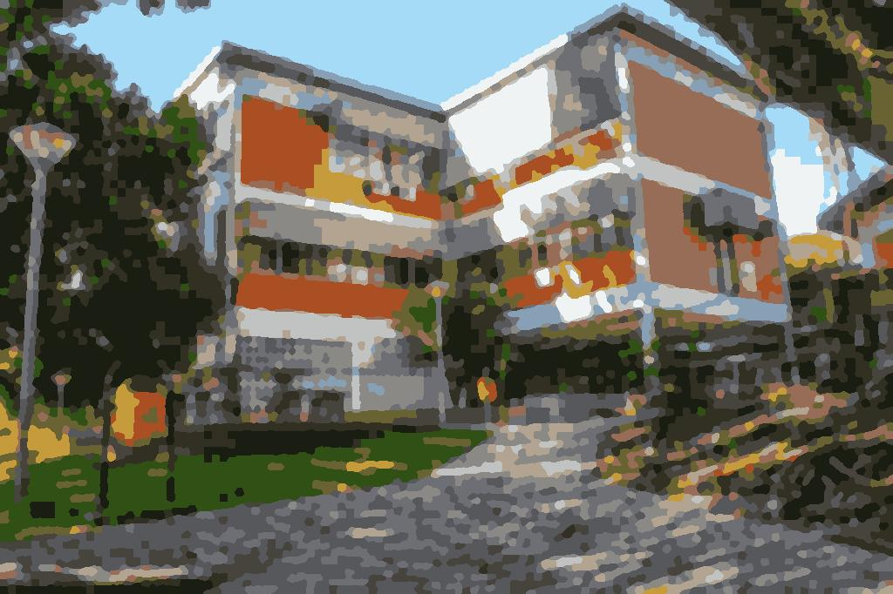

# Geração de Imagens para Pintura Terapeutica

## Resumo do Projeto

Geração de imagens para pintura terapeutica a partir de imagens com diferentes propriedades recebidas pelo usuário (eg: imagens fotorealistas, selfies, quadros, pinturas, desenhos animados etc).  

## Objetivo

Livros de colorir são uma uma categoria bastante comum em livrarias e bancas e possuem como público alvo desde crianças até jovens e adultos, mas nem sempre é possível encontrar um livro cujas ilustrações sejam de nosso interesse.

Pensando nisso criamos esse projeto que permite gerar, a partir de uma imagem real de qualquer natureza, uma imagem de **pintura terapeutica** que possa ser impressa e colorida com o mapeamento de cores indicado pelo grupo.

Por fim, para garantir um resultado satisfatório do projeto e que o output possua qualidade tentaremos cumprir os seguintes requisitos:

- Limitar o número de cores a serem utilizadas, pois em um cenário real uma pessoa não teria todo o espectro de cores.
- Garantir que as áreas pintáveis foram geradas de forma razoável e de fácil interpretação.

## Estrutura do Projeto e Como Executar

Para executar o projeto, recomendamos o uso do script `main.py` que irá solicitar alguns parâmetros de configuração para o usuário e salvar os resultados obtidos na pasta `./images/output/`. Recomendamos a leitura dos arquivos em `./case` para garantir que os inputs estão sendo inseridos nos formatos corretos.

```
/
| -- main.py            Script com pipeline final p/ geração das imagens de preview e pintura.
| -- dependencies.txt   Lista de dependências do projeto.
| -- /src               Pasta com funções utilizadas ao longo do projeto;.
| -- /exploratory       Notebooks utilizados para estudo e exploração de técnicas de PDI.
| -- /cases             Entradas de exemplo para o arquivo main.py
| -- /images            Pasta com algumas das imagens utilizadas como input do projeto
```

Recomendamos o uso do Python 3 e a instalação das seguintes dependências listadas em `dependencies.txt`.

## Descrição do Pipeline de Processamento

O pipeline encontrado possui uma primeira etapa de pré-processamento e extração de paleta em comum mas consta com uma etapa de segmentação opcional utilizando o método SLIC (motivo discutido logo em seguida)

- **Pré-processamento**
  - **Leitura da Imagem** no formato `png` ou `jpg`
  - **Image Downsampling** para dimensões máximas de 1000x1000
  - **Image Enhance** utilizando Gaussian Filter (`sigma=2`)
  - ~~Quantitização da imagem para B bits para remover possíveis ruídos~~
- **Extração de Paleta de Cores (Quantização)**
  - **Kmeans Clustering** para extração das N Cores
  - **Recolorização** da imagem utilizando apenas cores da paleta
- **Quebra da imagem em Superpixels (Opcional)**
  - **SLIC Segmentation** para encontrar clusters de regiões de cores semelhantes
  - **Recolorização SLIC** da imagem utilizando a intensidade média de cada cluster
  - **Recolorização dos Clusters** aplicaçando a paleta de cores
- **Geração da Imagem Colorível e seu Preview**
  - **Edge Detection** por meio do mapa de labels/cores 
  - **Export das imagems** recolorizadas e de bordas na pasta `./images/output/`

### *Quando utilizar o método SLIC?*

Caso a imagem final possua regiões muito estreitas para serem de fato coloridas ou queira ter um maior controle no nível de detalhes final com maior precisão. 

### *Quando (não) utilizar o método SLIC?*

Recomendamos o uso do método SLIC em imagens complexas e com bordas pouco definidas. Um exemplo de quando não utizar o método seria em imagens artificiais como imagens de quadrinhos ou desenhos de animes.

## Imagens de Teste

Para realização dos testes utilizamos imagens com diferentes propriedades de uma base de imagens com licença copyleft: [https://unsplash.com/](https://unsplash.com/) e podem ser encontradas na pasta `images/raw/`.

Buscamos imagens com diferentes propriedades propositalmente para buscar cenários cujo tipo de imagem gerasse alguma limitação ou dificuldade adicional (Ex: retratos foto realistas, desenhos artificiais bem definidos, pinturas abstratas, pinturas monocromáticas).

## Resultados Obtidos



### Explorando métodos e alternativas

Na pasta `./exploratory` encontram-se alguns dos notebooks (ordenados aproximadamente baseado na ordem de progressão do projeto) utilizados pelo grupo para explorar os métodos utilizados (ou não) no pipeline final. Cada documento possui (geralmente) seu objetivo e comentários dos resultados obtidos no decorrer de cada documento.

TODO AQUI Casos bons e ruins :P

## Participantes

Gabriel Van Loon

Giovani Decico Lucafó

Tamiris Fernandes Tinelli

Projeto para Disciplina de Processamento de Imagens (2021.1)
